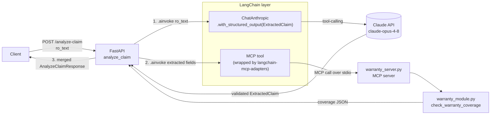
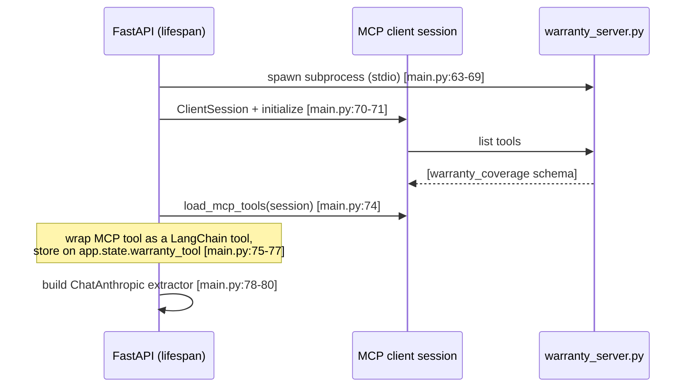
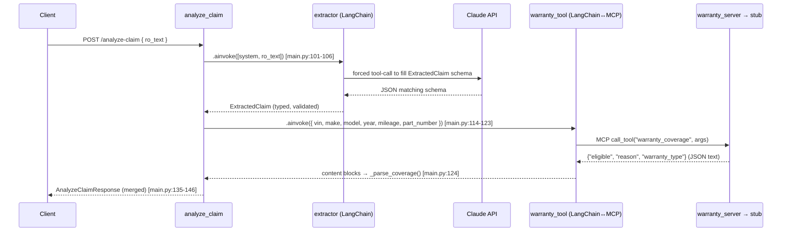

# Architecture — how LangChain and MCP fit together

This service does two things on every `POST /analyze-claim`:

1. **Extract** typed fields from messy repair-order text — via **LangChain + Claude**.
2. **Look up** warranty coverage — via an **MCP tool**, reached *through* LangChain.

The key idea: LangChain gives you **one uniform `.ainvoke()` interface** over two
very different backends — the Claude LLM and an external MCP tool.

```
                    ┌─ ChatAnthropic ───────────► Claude API      (extraction)
your code ─ .ainvoke ┤
                    └─ MCP-wrapped tool ────────► warranty_server ► warranty stub
```

---

## Big picture (flow)



---

## What happens at startup (once)

The MCP wiring is set up a single time in the FastAPI **lifespan**
([main.py:60-83](main.py#L60-L83)), then reused for every request.



**Why once?** Spawning the MCP server and opening the session per request would be
slow. The `AsyncExitStack` holds the session open for the app's lifetime and tears
it down cleanly on shutdown ([main.py:68](main.py#L68), [main.py:83](main.py#L83)).

---

## What happens per request



---

## The LangChain steps, in words

### Step 1 — Extraction (`ChatAnthropic` + structured output)

- **`ChatAnthropic(model="claude-opus-4-8")`** ([main.py:78-79](main.py#L78-L79))
  is LangChain's adapter for the Anthropic API. It exposes the same `.ainvoke()`
  interface every LangChain component uses — swapping providers wouldn't change the
  calling code.
- **`.with_structured_output(ExtractedClaim)`** ([main.py:80](main.py#L80)) turns the
  Pydantic model in [models.py](models.py) into a schema, instructs Claude to fill it
  in (via tool-calling under the hood), and **parses + validates** the reply back into
  a typed `ExtractedClaim`. No manual JSON parsing, no "hope the LLM returned valid
  JSON."
- **`.ainvoke([("system", ...), ("human", ro_text)])`** ([main.py:101-106](main.py#L101-L106))
  runs it. You get `extracted.vin`, `extracted.mileage`, … already typed.

### Step 2 — The MCP bridge (`load_mcp_tools`)

- **`load_mcp_tools(session)`** ([main.py:74](main.py#L74)), from
  `langchain-mcp-adapters`, reads the tool schema advertised by the MCP server and
  **wraps it as a LangChain tool** — the same tool interface LangChain uses everywhere.
- That's why invoking the warranty check ([main.py:114-123](main.py#L114-L123)) looks
  *identical* to invoking the LLM: both are just `.ainvoke(...)` on a LangChain object.
  The MCP server ([warranty_server.py](warranty_server.py)) is what actually runs the
  provided `check_warranty_coverage` stub ([warranty_module.py](warranty_module.py)).

### Step 3 — Merge

The typed `ExtractedClaim` and the coverage dict are combined into the
`AnalyzeClaimResponse` ([main.py:135-146](main.py#L135-L146)) and returned.

---

## Why route the tool through MCP at all?

`check_warranty_coverage` is a plain Python function — we *could* just call it. Putting
it behind MCP models it as an **external, independently-deployable capability**: the
warranty logic could live in another process, another language, or another team's
service, and this app wouldn't change. `langchain-mcp-adapters` is the seam that lets
that external tool plug into the same LangChain `.ainvoke()` flow as the LLM.

---

## One-line summary per component

| Component | File | Role |
|---|---|---|
| FastAPI endpoint | [main.py](main.py) | Orchestrates the 3 steps |
| `ChatAnthropic` + structured output | [main.py:78-80](main.py#L78-L80) | LLM extraction → typed `ExtractedClaim` |
| `load_mcp_tools` | [main.py:74](main.py#L74) | Wraps the MCP tool as a LangChain tool |
| MCP server | [warranty_server.py](warranty_server.py) | Publishes the warranty capability over MCP |
| Warranty stub | [warranty_module.py](warranty_module.py) | The actual (mock) coverage logic |
| Schemas | [models.py](models.py) | Request / extraction / response shapes |
